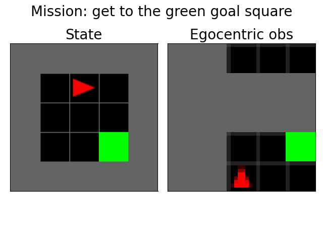

# dqn_instruction_following
Simple deep Q-learning implemention for instruction following. 

# Create conda environment
```
conda create --name minigrid python==3.7.11
```
```
pip install -r requirements.txt
```

# Egocentric vs Allocentric observations

```
python manual_control.py --env_key "Minigrid-PickUpObj-Custom-v0" --egocentric --size 12
```

<table>
  <tr>
    <td>  </td>
    <td>  </td>
    <td>  </td>
  </tr>   
</table>

# Training agent and visualising learned policies

```
python train.py --env_key "MiniGrid-Empty-Random-5x5-v0" --egocentric
python train.py --env_key "Minigrid-PickUpObj-Custom-v0" --egocentric
```
```
python visualise.py
```
<table>
  <tr>
    <td>  </td>
    <td>  </td>
  </tr>   
</table>
